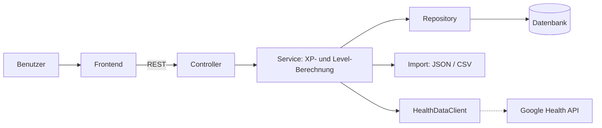

# Health Leveling System

Projekt im Modul 450 «Applikationen testen» an der TBZ.

## Projektbeschreibung

Das Health Leveling System ist eine Full-Stack-Applikation, die Gesundheitsdaten in ein spielerisches Level-System übersetzt. Ausgangspunkt war ein Google Fitbit Air Band, das ich geschenkt bekommen habe. Statt die Daten nur in einer App anzuschauen, wollte ich etwas bauen, das mich motiviert, regelmässig gut zu schlafen und mich zu bewegen.

Jede Benutzerin und jeder Benutzer hat ein Profil, das Erfahrungspunkte (XP) sammelt und dadurch im Level aufsteigt. Die Punkte werden anhand von Tageswerten berechnet, zum Beispiel:

- Schlaf-Score der letzten Nacht
- Anzahl Schritte pro Tag
- Anzahl und Dauer von Aktivitäten (z. B. Laufen, Velofahren, Training)

Im Vordergrund des Projekts steht nicht ein möglichst grosser Funktionsumfang, sondern eine saubere und nachvollziehbare Testabdeckung.

## Datenquellen

Die Applikation unterstützt drei Wege, um Daten zu erfassen:

1. **Manuelle Eingabe** über ein Formular in der Applikation. Die Eingaben werden im Backend validiert (z. B. keine negativen Schrittzahlen, Schlaf-Score zwischen 0 und 100).
2. **Import** von exportierten Daten aus dem Google-Konto als JSON- oder CSV-Datei.
3. **Google Health API** (optional): Falls die API noch verfügbar und nutzbar ist, werden die Daten direkt abgerufen. Da unklar ist, wie lange die Schnittstelle noch unterstützt wird, ist sie so angebunden, dass sie problemlos ersetzt oder weggelassen werden kann.

## Funktionen

**Grundversion (MVP)**

- Profil mit aktuellem Level, XP und Fortschrittsbalken
- Manuelle Erfassung von Tageswerten
- Import von JSON- und CSV-Dateien
- Berechnung von XP und Levels nach festen Regeln
- Übersicht der erfassten Tage

**Erweiterungen (falls die Zeit reicht)**

- Anbindung der Google Health API
- Statistiken und Verlauf als Diagramm
- Streaks (z. B. Bonus-XP für 7 Tage in Folge über 10'000 Schritte)
- Achievements

## Tech-Stack

| Bereich | Technologie |
|---|---|
| Backend | Java, Spring Boot |
| Frontend | [z. B. React / Angular / Vue] |
| Datenbank | [z. B. H2 für Entwicklung, PostgreSQL] |
| Build | Maven / Gradle |
| Unit Tests | JUnit 5 |
| Mocking | Mockito |
| Integration Tests | Spring Boot Test |
| Code Coverage | JaCoCo, evtl. SonarQube / SonarCloud |
| CI/CD | GitLab CI/CD |

## Architektur



Die externe Schnittstelle ist hinter einem eigenen Interface (`HealthDataClient`) gekapselt. Dadurch kann sie in den Tests gemockt und bei Bedarf durch den Datei-Import ersetzt werden.

## Teststrategie

| Testebene | Was wird getestet | Werkzeug |
|---|---|---|
| Unit Tests | XP-Berechnung, Level-Aufstieg, Validierung der Eingaben, Parsing von JSON und CSV | JUnit 5 |
| Unit Tests mit Mocks | Services, die auf die API oder das Repository zugreifen | JUnit 5, Mockito |
| Integration Tests | Zusammenspiel von Controller, Service und Datenbank über die REST-Endpunkte | Spring Boot Test |

**TDD:** Die Logik für die XP- und Level-Berechnung entwickle ich nach dem Red-Green-Refactor-Prinzip, weil die Regeln klar definiert sind und sich gut als Tests formulieren lassen.

**Mocking:** Die Google Health API wird in allen Tests weggemockt. So hängen die Tests weder von echten Gesundheitsdaten noch von der Erreichbarkeit der API ab.

**Grenzwerte:** Bei der Validierung werden gezielt Grenzfälle getestet, z. B. 0 Schritte, ein Schlaf-Score von genau 100, leere oder fehlerhafte Import-Dateien.

Das ausführliche Testkonzept befindet sich unter [`docs/testkonzept.md`](docs/testkonzept.md).

## CI/CD-Pipeline

Die GitLab-Pipeline besteht aus folgenden Stages:

1. **build** – Kompilieren der Applikation
2. **test** – Ausführen der Unit- und Integration Tests
3. **report** – Testreports (JUnit-XML) und Code Coverage (JaCoCo) werden in GitLab angezeigt
4. **deploy** – nur beim Merge auf `main`

Schlagen Tests fehl, wird nicht deployed.

## Planung

| Phase | Inhalt |
|---|---|
| 1 | Projekt aufsetzen, Pipeline einrichten, Testkonzept erstellen |
| 2 | XP- und Level-Logik mit TDD umsetzen |
| 3 | Manuelle Eingabe und Validierung, Unit Tests |
| 4 | JSON- und CSV-Import, Tests mit Beispieldateien |
| 5 | Frontend und Integration Tests |
| 6 | Optional: API-Anbindung und Erweiterungen |
| 7 | Dokumentation, Reflexion, Präsentation vorbereiten |

## Arbeitsweise

- Jedes Feature wird in einem eigenen Feature-Branch entwickelt und per Merge Request auf `main` gebracht.
- Commits erfolgen laufend in kleinen, nachvollziehbaren Schritten.
- Merge Requests werden reviewt und kommentiert, bevor sie gemerged werden.

## KI-Nutzung

[Hier ehrlich festhalten, ob und wie KI verwendet wurde, z. B.:]

- Als Nachschlagewerk für Detailfragen: [ja / nein]
- Code schreiben mit Autocomplete (z. B. Copilot): [ja / nein]
- Code automatisch durch einen Agenten erstellen lassen: [ja / nein]
- Reviewen oder Optimieren von bestehendem Code: [ja / nein]
- Erstellen der Dokumentation: [ja / nein]

## Installation und Start

```bash
# Repository klonen
git clone [Repo-URL]
cd health-leveling-system

# Backend starten
./mvnw spring-boot:run

# Tests ausführen
./mvnw test

# Coverage-Report erstellen (target/site/jacoco/index.html)
./mvnw verify
```

## Reflexion

Die Reflexion zu TDD und Code Reviews folgt am Ende des Projekts unter [`docs/reflexion.md`](docs/reflexion.md).

## Autor

Felípe Pereira TBZ

### Nutzvolle LInks

https://me.developers.google.com/

https://developers.google.com/oauthplayground